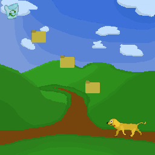

# Team Jersey Shore

## Canonical game repo URL:

https://github.com/SodiKroehler/JerseyShoreTeam

## Team Members
* Advanced Topic Subteam 1: Physics

	* Jack
		* Pitt Username: jcb185
		* Github Username: jCBellamy0
	* Freddie
		* Pitt Username: frs39
		* Github Username: fridizkool
	* Wuyue
		* Pitt Username: wul5
		* Github Username: Lucaserlw
	* Zhimin
		* Pitt Username: zhl157
		* Github Username: Krisocer

* Advanced Topic Subteam 2: Natural Language Processing

	* Sodi
		* Pitt Username: sek188
		* Github Username: SodiKroehler
	* Sierra
		* Pitt Username: sig29
		* Github Username: SSkyeG
	* Sydni
		* Pitt Username: SNR44
		* Github Username: sydniroller
	* Qiran
		* Pitt Username: QIL68
		* Github Username: Qiran2022

## Game Description

You are stuck in the Windows XP desktop. You must move around and interact with various programs and folders in order to find out more about the User. Eventually, you’ll find the password to unlock the email program and use it escape to the great World Wide Web.

## Concept Art

Desktop View & Rover

## Advanced Topic Description

### Physics

We are using rigid body components to create minigames, that are escape room adjacent. Using these rigid bodies, we will implement elastic and inelastic collisions, rotaions, and kinematics. Simulated by at least 2 entities at the same time.
    
### Natural Language Processing

We will enable the search dog Rover to answer certain questions. We will utilize sentence similarity algorithms (starting with a simple bag-of-words and hopefully refining into a word-vector type) to identify the proper response.

## Midterm Goals

* Tokenize user messages
* Player movement
* Player can interact and tip over recycling
* Create Rover after Recycling tipped over
* Finalize story plan
* Basic UI implemented

## Final Goals

* 20%: Rover Communication - Player can interact with rover and he will respond intelligently, giving hints according to his pleasure.
  * 10%: Rover can give the correct answer/hint to pre-defined questions, based on characteristics of the player.
  * 10%: Rover can recognize and answer questions that are simple derivatives of the ones he is equipped to answer.
* 20%: Rigidbody Kinematics - Create collision and kinematics mechanics, allowing things to bounce off of each other and roll
  * 5%: collision
  * 5%: rolling
  * 5%: 2 entites interacting at least
  * 5%: basic kinematics (moving, acceleration, etc.)
* 20%: Completeness - Player can traverse the scape of the desktop, open and go into folders to view different media such as text files, and pictures
  * 5%: jumping on folders
  * 5%: going into folders/games
  * 5%: getting out of folders/games
  * 5%: viewing different types of media like pictures, and text files
* 10%: Exploration - Player can enter at least 2 other rooms to do puzzles to progress in the game
  * Each room is 5%
* 10%: Distraction - There are at least 2 red herring actions or rooms that may distract the player from the final goal
  * Each red herring is 5%

## Stretch Goals

* Bug creation, have to shoot randomly occurring bugs
* Generating the password to email based on questions asked to Rover
